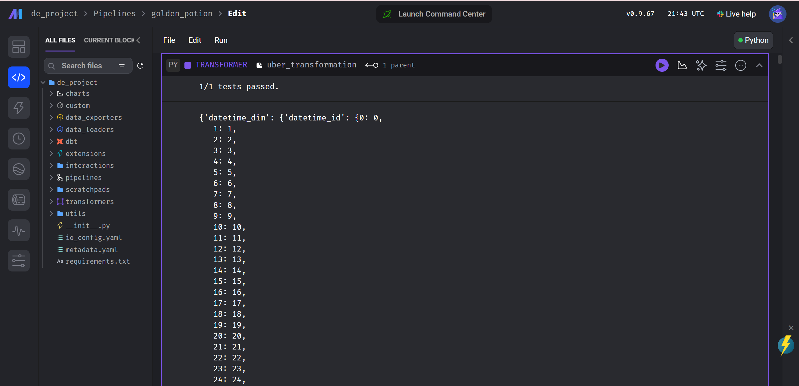
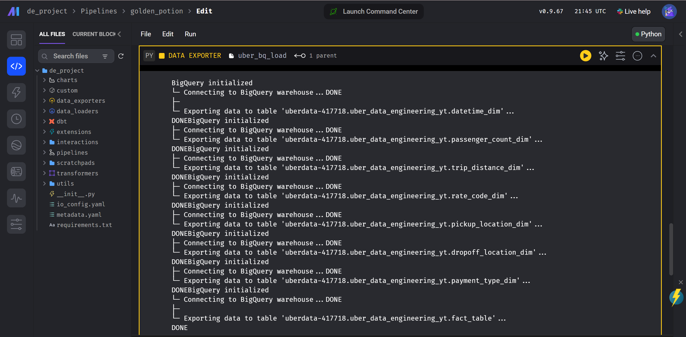

# Uber-ETL-Automation-with-Airflow-Mage

## Introduction
The project focuses on performing thorough data analytics on Uber datasets, leveraging an array of tools like GCP Storage, Python, Compute Instance, Mage Data Pipeline Tool, BigQuery, and Looker Studio. Our methodology includes:

# Project Overview

This project aims to conduct comprehensive data analytics on Uber datasets by leveraging a variety of tools and technologies. The process involves several key steps:

- **Data Structuring with Lucid:** We begin by structuring Uber data using Lucid to create a comprehensive data model.

- **Data Extraction and Transformation with Mage:** Using Mage, we extract data from APIs and transform it into a star schema. Subsequently, the transformed data is loaded into BigQuery, making use of Google Cloud's compute instance.

- **In-depth Analysis on Google BigQuery:** We delve into detailed analysis on Google BigQuery, harnessing its computational capabilities to gain valuable insights from the data.

- **Visualizations with Looker Studio:** Insights derived from the analysis are presented through intuitive visualizations using Google's Looker Studio.

## Architecture 

## Technologies Used

### Programming Language
- Python

### Google Cloud Platform
1. Google Storage
2. Compute Instance 
3. BigQuery
4. Looker Studio

### Modern Data Pipeline Tool
- [Mage](https://www.mage.ai/)

## Dataset Used
TLC Trip Record Data
Yellow and green taxi trip records include fields capturing pick-up and drop-off dates/times, pick-up and drop-off locations, trip distances, itemized fares, rate types, payment types, and driver-reported passenger counts. 

Here is the dataset - https://github.com/rohitaragde/Uber-ETL-Automation-with-Airflow-Mage/blob/master/data/uber_data.csv

More info about dataset can be found here:
1. Website - https://www.nyc.gov/site/tlc/about/tlc-trip-record-data.page
2. Data Dictionary - https://www.nyc.gov/assets/tlc/downloads/pdf/data_dictionary_trip_records_yellow.pdf

## Data Model

## Execution Process

### Step 01: Open Jupyter Notebook and Load the Raw Dataset

Open Jupyter Notebook and load the raw dataset. Have a look at the raw data.

### Step 02: Open Lucid and Create a Data Model

Open Lucid and create a data model based on the raw data.

### Step 03: Perform Aggregations to Convert Data into Data Model

Return to Jupyter Notebook and perform all the necessary aggregations to convert the data into the data model required for replication in Mage.

### Step 04: Setup GCP Compute Instance and BigQuery Bucket

Setup a Google Cloud Platform (GCP) Compute instance for Mage

 Setup a Google Cloud Bucket for loading the dataset from where the Mage will fetch the data

### Step 05: Write Transformation Scripts in Mage

Go to Mage and write the transformation scripts in Python as required.

### Step 06: Perform ETL Process in Mage

Execute the ETL process using Mage. The data will be transformed and later on will be loaded into the Google Cloud BigQuery bucket. 

Also, Remember to update the yaml file according to your gcp credentials from the API and Services tab in the Google CLoud.

## Data load from GCP Bucket API to Mage

# Perform Data Transformations to convert it into STAR Schema and all other data trasnformations

# Finally, Load the Data to the biquery tables

# The Mage Tree once the ETL process is successfully completed

### Step 07: BigQuery Data Load

Once the data loader is executed in mage the data will be loaded finally into the bigquery tables with all the transformations performed and where the querying and analysis will be performed.

### Step 08: Perform Some Analysis on the Data

Performed some analysis post loading the final data into the bigquery tables:-

### Step 09: Finally, Perform analysing and depict the same on Google Studio

Perform analysis on the final data and develop a final dashboard using Google Studio.

### Reference
Video Link - https://youtu.be/WpQECq5Hx9g

